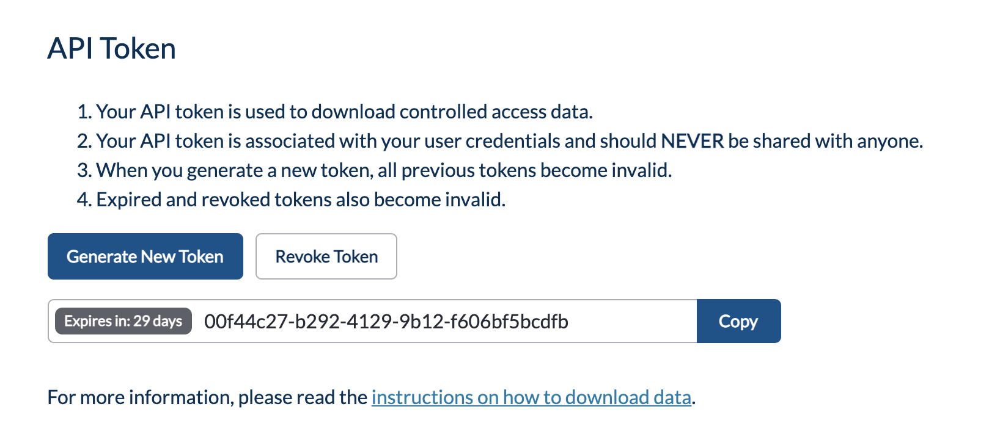

Before uploading data, ensure you've set up user permissions in Ego, generated the necessary API Key in DMS UI, and configured the Song and Score clients. This guide provides step-by-step instructions for these prerequisites.

# Configure User Permissions in Ego

If you have already completed this configuration during your [post-deployment verification and configuration](../verify) feel free to skip ahead.


1. **Login to Ego UI:** Use your [admin user credentials](../verify#login-and-configure-ego). Access via:
   - Local: `http://localhost:<port>/ego-ui`
   - Server: `https://<myDomain>/ego-ui`
   

2. **Check Groups:** Under **Groups**, ensure `dms-admin` group exists with permissions `DMS.WRITE`, `SONG.WRITE`, `SCORE.WRITE`.


3. **Check User Permissions:** Under **Users**, ensure your user type is `ADMIN`, associated with `dms-admin` group, and has the aforementioned permissions.

# Generate API Key in DMS UI

1. **Login to DMS UI:** Use the [admin user credentials](../verify#login-and-configure-ego-ui). Access via:
   - Local: `http://localhost:<port>/dms-ui`
   - Server: `https://<myDomain>`


2. **Profile & Token:** Click on your name at the top-right, select **Profile & Token**. Your profile should be visible with your name, email, and identity provider details.


3. **Generate Token:** Click **Generate Token**, note its validity period. Record and securely store your token.




4. **Verify Token in Ego UI:** Back in Ego UI, under your profile, confirm the new token is `ACTIVE` with the correct `SCOPES` (permissions).

# Download and Configure Song Client via Docker

Next, you must download and configure the Song client.  This command-line client is used for various metadata operations such as submitting analyses, creating file manifests for Score, and so on.  To understand how to use Song in more detail, see [here](../../song/).

**Running the song-client docker image** 

You will be required to supply environment variables for the `CLIENT_STUDY_ID`, the `CLIENT_SERVER_URL` and your `ACCESSTOKEN`.

```bash
docker run -d -it --name song-client \
-e ACCESSTOKEN=${token} \
-e CLIENT_STUDY_ID=ABC123 \
-e CLIENT_SERVER_URL=http://<INSERT-URL>/song-api \
--network="host" \
--mount type=bind,source="$(pwd)",target=/output \
ghcr.io/overture-stack/song-client:latest
```

- Set `ACCESSTOKEN` to the API Key you recorded earlier via DMS UI.
- Set `CLIENT_STUDY_ID` to `ABC123` (the study for which you will be -submitting data).
- Set `CLIENT_SERVER_UR` based on your deployment mode:
   - Local: `http://localhost:<port>/song-api`
   - Server: `https://<myDomain>/song-api`

# Download and Configure Score Client via Docker

Next, you must download and configure the Score client.  This command-line client is used to upload and download data files to and from your configured object storage service.  To understand how to use Score in more detail, see [here](../../score).

**Running the score-client docker image** 

You will be required to supply environment variables for the `STORAGE_URL`, the `METADATA_URL` and your `ACCESSTOKEN`.

```bash
docker run -d -it \
--name score-client \
-e ACCESSTOKEN=${token} \
-e STORAGE_URL=http://<INSERT-URL>/score-api \
-e METADATA_URL=http://<INSERT-URL>/song-api \
--network="host" \
--mount type=bind,source="$(pwd)",target=/output \
ghcr.io/overture-stack/score:latest
```

- Set `ACCESSTOKEN` to the API Key you recorded earlier via DMS UI.
- Set `METADATA_URL` based on your deployment mode:
   - Local: `http://localhost:<port>/song-api`
   - Server: `https://<myDomain>/song-api`
- Set `STORAGE_URL` based on your deployment mode:
   - Local: `http://localhost:<port>/score-api`
   - Server: `https://<myDomain>/score-api`

