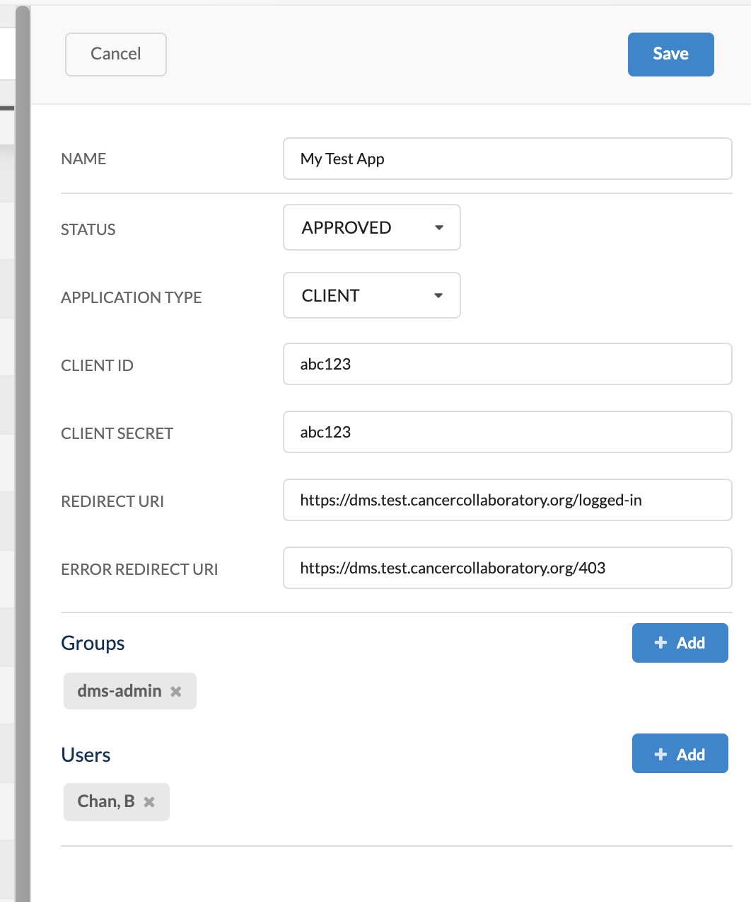

# Managing Applications

An application is a third-party service that registers itself with Ego to allow Ego to authorize users on its behalf. When registering an application, you need to provide secure credentials in the form of a `Client ID` and `Client Secret` pair that you have generated.

## Creating an Application

To create a new application, follow these steps:

1. Click **Applications** in the left-hand menu, then click **Create** in the right-hand panel.

2. The application fields will appear in the right-hand panel. Populate them as follows:

| Field               | Description                                                                                       |
|--|--|
| Name                | Descriptive name for your application                                                            |
| Status              | Status of the application, determines if it is enabled for use or not. Possible values: `DISABLED`, `APPROVED`, `PENDING`, `REJECTED`. To enable your app for use, select `APPROVED`. |
| Application Type    | Indicates whether the application is a client to Ego or an administrative app. If it's not the Ego UI app itself, set it to `CLIENT`. |
| Client ID           | Secure `Client ID` of the application, used to authenticate with Ego                              |
| Client Secret       | Secure `Client Secret` of the application, used to authenticate with Ego                          |
| Redirect URI        | URI where you want to redirect the user after successful login to your app                        |
| Error Redirect URI  | URI where you want to redirect the user in case an authentication error occurs during login. This is typically an error page for authentication issues. |
| Groups              | Use the `+ Add` button to add existing groups that will be able to use this application. To remove a group, click the `X` button next to the group. |
| Users               | Use the `+ Add` button to add existing users who will be able to use this application. To remove a user, click the `X` button next to the user. |

3. Click **Save** to create the application. You can now assign groups and users to it.

## Editing an Application

To edit an application, follow these steps:

1. Click **Applications** in the left-hand menu, then click the application you want to edit from the applications table.

2. The application's details pane will be displayed on the right. Click **Edit** and modify the fields as required. The fields are the same as described earlier in [Creating an Application](/documentation/ego/user-guide/admin-ui#creating-an-application).

## Deleting an Application

To delete an application, follow these steps:

1. Click **Applications** in the left-hand menu, then click the application you want to delete from the applications table.

2. The application's details pane will be displayed on the right. Click **Delete**. You will be prompted to confirm the deletion.

<Warning> **NOTE:** Before deleting an application, ensure that this is the intended action, as it cannot be reversed. You can manually re-create the application if needed, but the previous details will be lost.</Warning>