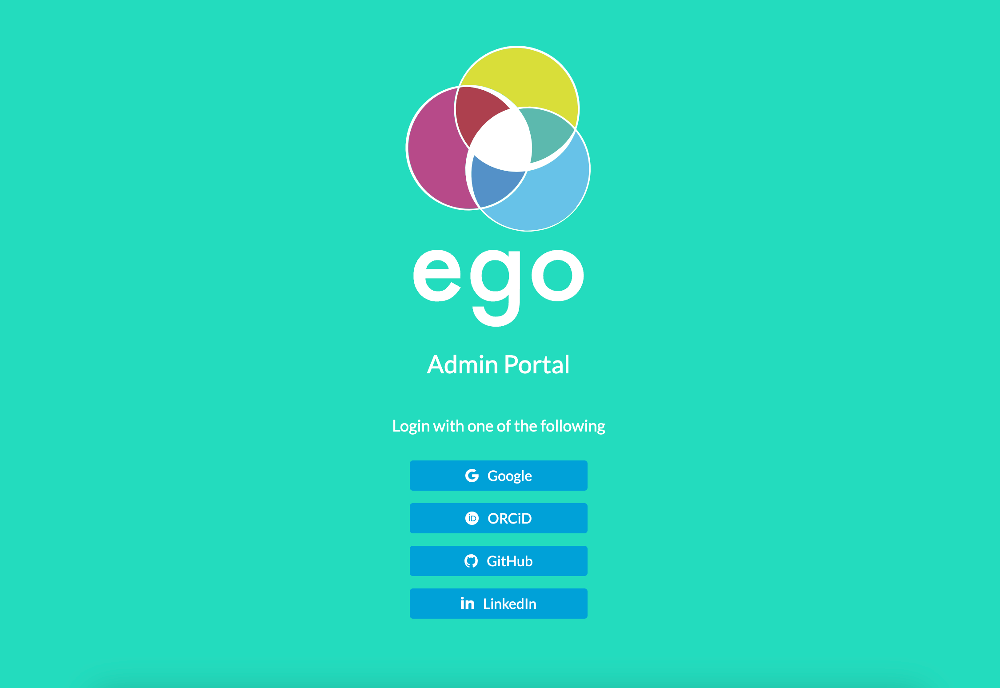
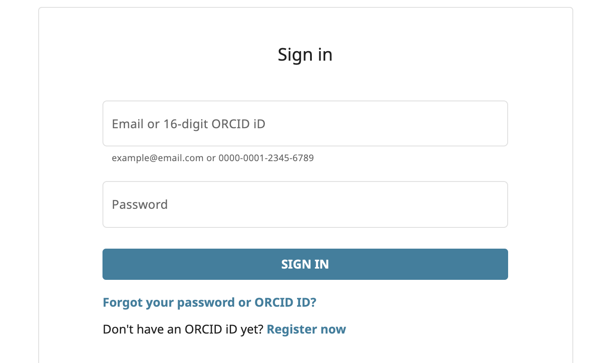
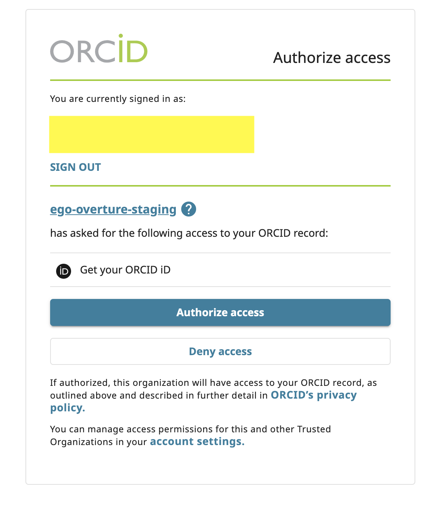
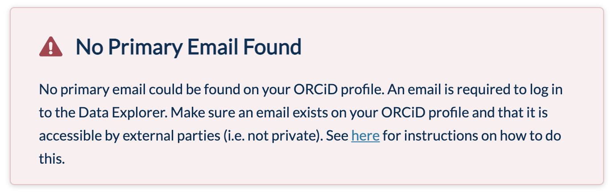
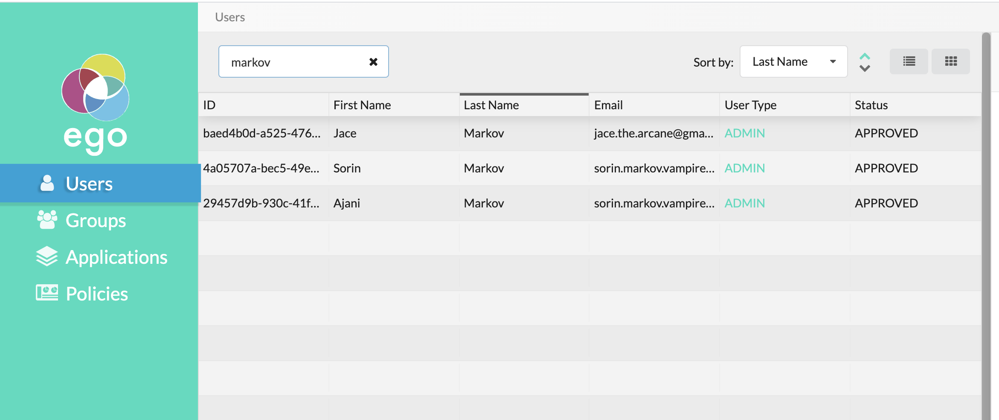

The Ego administrative UI allows you to easily manage your applications, users, groups, and policies all from a single web interface.

# Logging In

To log into the Ego admin UI, follow these steps:

1. Navigate to `<url>/ego-ui` (replace `<url>` with the base URL or domain where you have deployed Ego).

2. Choose the identity provider you want to use for login. In this example, we will use ORCiD.

3. Grant access to Ego for your profile on the selected identity provider.

<Warning> **NOTE:** If you prefer not to grant Ego access, your only option is to log in again using a different identity provider that you are comfortable granting access to.</Warning>

4. After granting access, you might encounter an error message if your email address is not set to public on your identity provider profile.

If your identity provider allows adjusting this setting, you should make your email accessible. Refer to the <a href="../../../../installation/configuration/prereq/emails" target="_blank">instructions here</a> for guidance. Alternatively, you can log in using a different provider that either doesn't have such a setting or doesn't necessitate making your email public.

5. Once logged in successfully, the default view displays the list of users registered in Ego.

