For Authorization and Authentication, Score readily supports two options:

- [Keycloak](https://www.keycloak.org/), a highly regarded open-source identity and access management (IAM) service developed by Red Hat

- [Ego](https://www.overture.bio/documentation/ego/), Overture's original authorization and authentication solution.

The most suitable platform will depend on your project's specific requirements. Information on setting up both services with Score can be found below.

# Keycloak Setup

There are multiple methods of deploying Keycloak, documentation on Keycloak deployment can be found on the [Official Keycloak website](https://www.keycloak.org/guides#getting-started). 

To expedite the setup process using docker, execute the following command in your terminal:

```bash
docker run --name Keycloak -d -p 8080:8080 -e KEYCLOAK_ADMIN=admin -e KEYCLOAK_ADMIN_PASSWORD=admin quay.io/keycloak/keycloak:22.0 start-dev
```

This command starts Keycloak exposed on local port `8080`and creates an initial admin user with the username `admin` and password `admin`

<Note title="Development Configuration Caution">This setup is designated for development and testing purposes and should not be used in production settings. For production deployments, please refer to [Configuring Keycloak for Production](https://www.keycloak.org/server/configuration-production).</Note>

## Overture API Key Provider

The Overture API Key provider extends Keycloak's functionality, by adding custom logic that allows Keycloak to interact with Score. The following steps outline how to download and install the Overtures API Key provider.

1. Using the following link **download the [Overture API Key Provider](https://github.com/oicr-softeng/keycloak-apikeys/releases/download/1.0-SNAPSHOT/keycloak-apikeys.jar)**.
2. **Move the** `keycloak-apikeys.jar` file to the provider's folder within Keycloak (`opt/keycloak/providers/`).
3. **Restart the Keycloak server** for the updated provider to take effect.

<Note title="Does this look familiar?">If you have previously set up Score with Keycloak, you can skip ahead to the application setup section on this page.</Note>

## Realm Configuration

### Login to the admin console

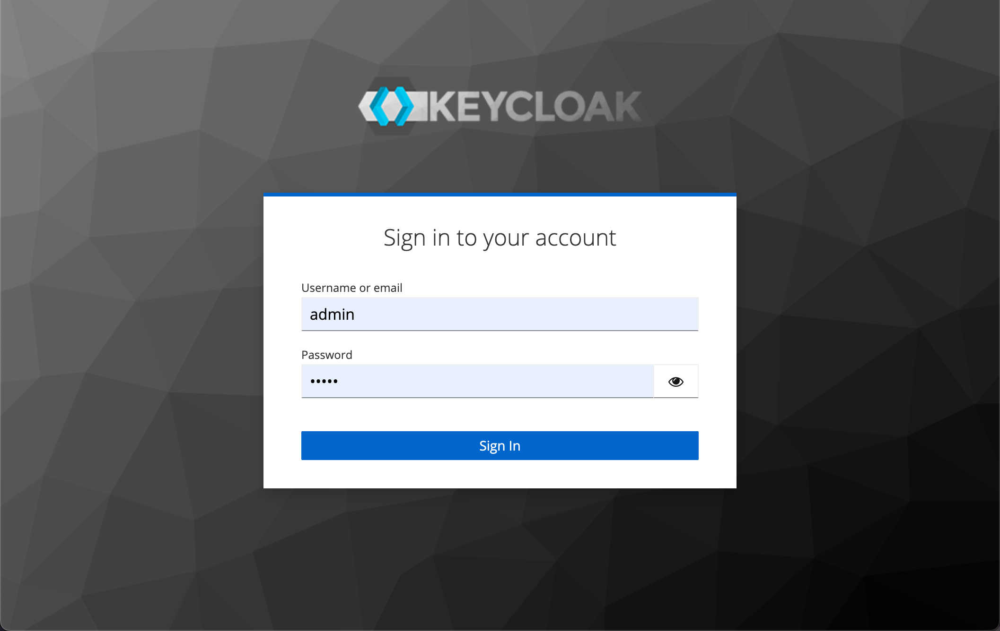


To access the admin console, navigate to `<url>/admin` (e.g., `localhost:8080/admin`) and log in with the credentials made during your Keycloak deployment.

### Create a realm

Keycloak supports the creation of realms for managing isolated groups of applications and users. The default realm is named "master," and is intended solely for Keycloak management.

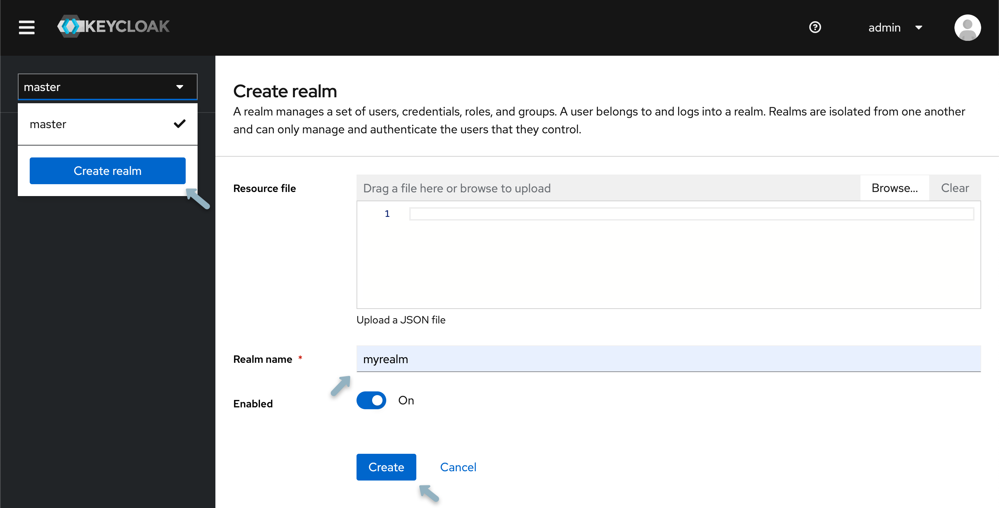

1. Open the **Keycloak Admin Console**.
2. In the top-left corner, **select "master"**, then choose **"Create Realm".**
3. **Type** `myrealm` in the Realm Name field and select **"Create".**

### Creating a group

As an example, we will create a `data submitters` group. After, we will configure and apply the appropriate permissions for this group.


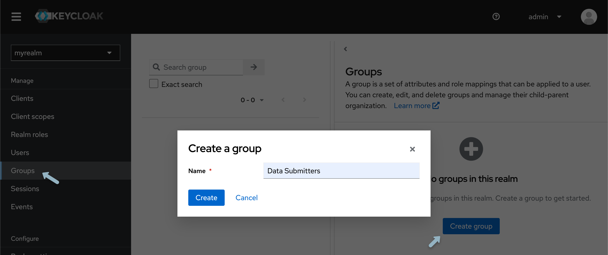

1. From the left-hand panel, select **"Groups"** and click **"Create group"**.
3. **Name the group** `data submitters` and select **"create"**.

### Creating a User

To populate the realm with its first user:

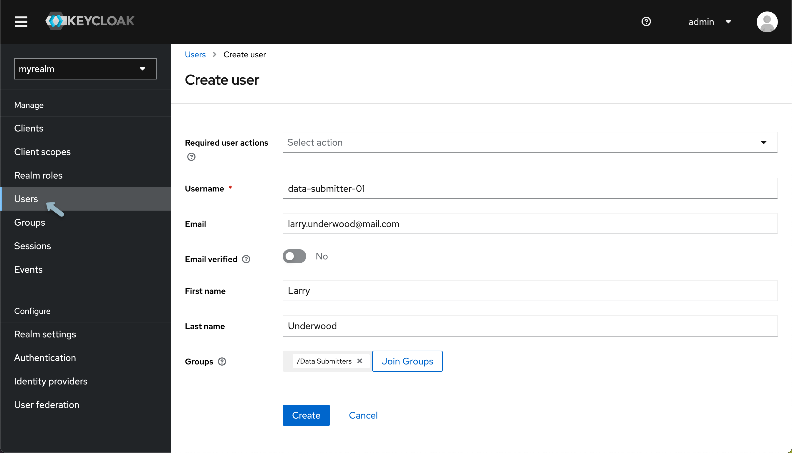

1. From the **Keycloak Admin Console**, under your newly created realm from the left-hand menu select **"Users"** and click **"Add User".**
2. **Input your details**, and then click **"Create"**.

<Note title="Keycloak User Administration">Various configurations can be applied to new users, detailed information can be found within [Keycloaks official Server Administration documentation](https://www.keycloak.org/docs/latest/server_admin/)</Note>

Next, a password must be established:

1. At the top of the **User details page**, select the **""Credentials" tab"** 
2. **Input your Password**. To avoid mandatory password updates upon first login **set "Temporary" to "Off"** 
3. Using the newly created username and password **login to the Keycloak Account Console** accessed from `http://localhost:8080/realms/myrealm/account/`. 

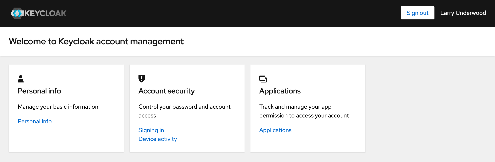

From the Account Console, users can manage their accounts, modify profiles, activate two-factor authentication, and link identity provider accounts.

## Application Setup

Before we set up and apply permissions we must create a "client" for the Score API.

1. Re-open your Keycloak admin console located at `<url>/admin` and confirm you are within your recently created realm.
2. Select **"Clients"** and then **"Create client"** and input the following:

| Field      | Value          |
|------------|----------------|
| **Client Type**   | OpenID Connect  |
| **Client ID** | score-api |

3. Select **"Next"** and **turn on Client Authentication**, confirm **Standard flow is enabled**, turn **authorization on** and then click **"next"** and then **"Save"** (Nothing needs to be inputted for login settings).

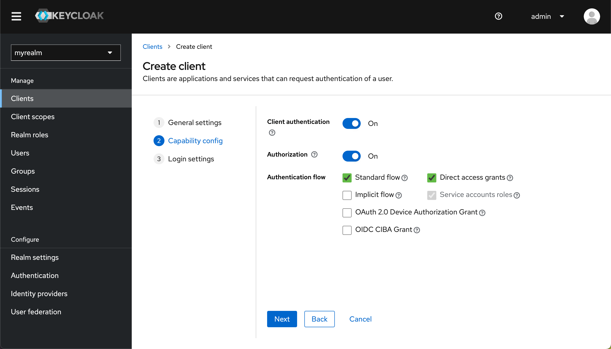

<Warning>Make sure you have toggled on both **"Client Authentication"** and **"Authorization"**</Warning>

### Configuring your Application

After creating our client, the next step is configuring the resource name, scopes, policies, and permissions. All these settings can be adjusted within the **Authorization tab** of the client you've just created. To access your client select **"Clients"** from the left-hand navigation menu and from the **"Client list"** select the newly created client.

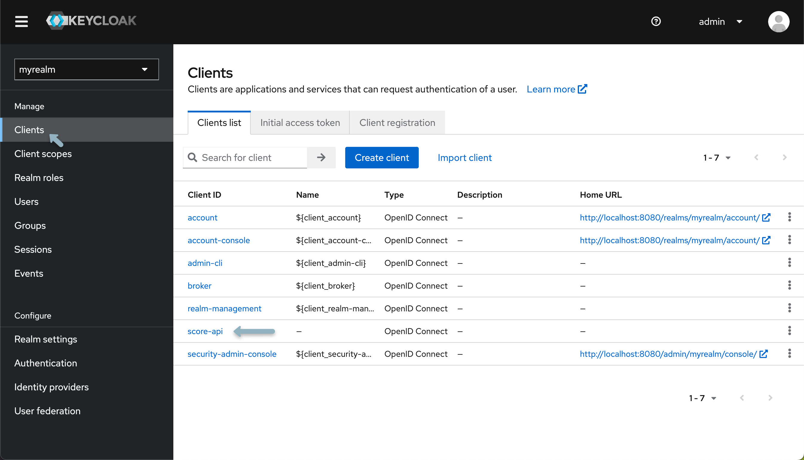

#### Scopes

Scopes represent actions that users can perform on a particular resource. They define the level of access a user has to a resource, such as reading, writing, updating, or deleting. For more details, checkout the following [Keycloak documentation](https://www.keycloak.org/docs/latest/authorization_services/index.html#scope)

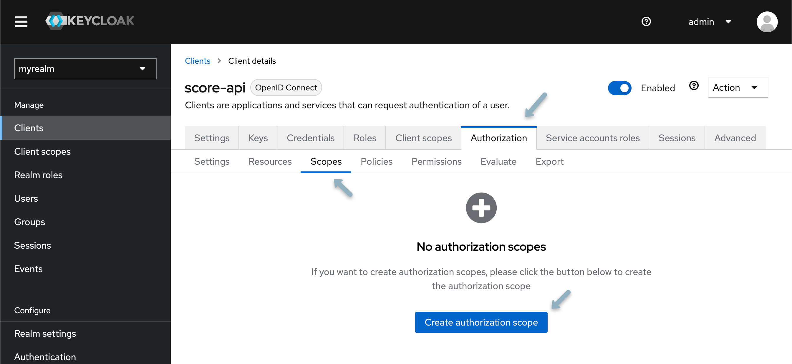

1. Navigate to the **Scopes tab** and select **"Create Authorization Scope"**
2. **Create two authorization scopes**, one for **READ** and one for **WRITE** access.

#### Resources

Resources are objects or entities that users can interact with, such as a database, a file, or an API endpoint. When defining resources, you assign them to specific scopes, indicating what actions can be performed on those resources. For more details, checkout the following [Keycloak documentation](https://www.keycloak.org/docs/latest/authorization_services/index.html#resource)


1. From the **Resource tab**, select **"Create Resource"**.
2. Your first resource is generalized and will not be associated with any specific study or program. Name the resource `score`, and from the **authorization scopes field** dropdown select **"READ" and "WRITE"**.
3. **Click save** and return to the client details page.

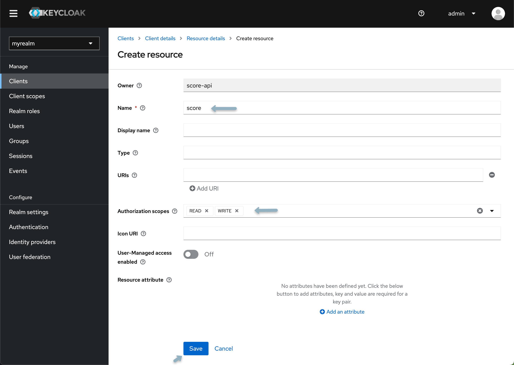

<Note title="Introducing New Studies or Programs">When introducing a new study or program, the creation of an additional resource within Keycloak is required. This includes re-applying the following policies, scopes and permissions to desired users and groups.</Note>

#### Policies

Policies are rules that determine who can access resources based on certain conditions. They encapsulate the logic to decide whether to grant or deny access. Policies can be based on group membership, user attributes, or time-based conditions. For more details, checkout the following [Keycloak documentation](https://www.keycloak.org/docs/latest/authorization_services/index.html#policy)

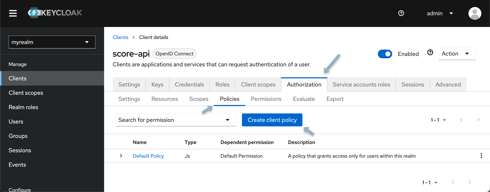

1. Select the **Policy tab** and click **"Create Client Policy"**
2. From the popup modal select **"group policy"**.
3. Name your policy (e.g., `data submission policy`) and select **"Add groups** from the modal check the box next to the Data Submitter group and click **"Add"** then **"Save"**.

#### Permissions

Permissions are the final decision-making mechanism connecting resources, scopes, and policies. They define which users or groups can access which resources under what circumstances. Permissions are evaluated based on the evaluation strategy chosen (e.g., Affirmative, Unanimous, or Consensus).  Permissions can be resource-based, meaning they apply directly to a resource, or they can be scope-based, meaning they apply to a scope or combination of scopes and resources. For more details, checkout the following [Keycloak documentation](https://www.keycloak.org/docs/latest/authorization_services/index.html#permission)


1. Select the **permissions tab**, click **"Create Permission"** and from the dropdown select **"Create resource-based permission**.
2. Assign the newly created resource, scope, and policy. Select `Affirmative strategy`.

## Creating a New Study

As mentioned previously, when introducing a new study or program, the creation of an additional resource within Keycloak is required. This includes re-applying policies and permissions to desired users and groups. 

To add a new study, **create a new resource** with the desired name of your study or program (i.e. `study123`) and **repeat the steps outline above**, specifically the Resources, Policies and Permissions sections of [configuring your application](/documentation/score/docker-install/configuration/authentication/#configuring-your-application). Once complete you should have the following:

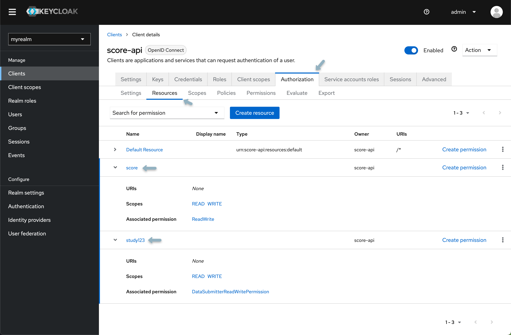

## Integration with Score

Update your `.env.score` file with the required Keycloak variables, the following code block will help you get started:

```bash
# ============================
# Keycloak Configurations
# ============================

# Keycloak-specific profile configuration
SPRING_PROFILES_ACTIVE=collaboratory,prod,secure

# Server and authentication settings
SERVER_PORT=8087
SERVER_SSL_ENABLED=false

# Logging
LOGGING_LEVEL_ORG_SPRINGFRAMEWORK_WEB=INFO
LOGGING_LEVEL_BIO_OVERTURE_SCORE_SERVER=INFO
LOGGING_LEVEL_ROOT=INFO

# Server Authentication integration
AUTH_SERVER_PROVIDER=keycloak
AUTH_SERVER_KEYCLOAK_HOST=http://localhost:8080 
AUTH_SERVER_KEYCLOAK_REALM=myrealm 
AUTH_SERVER_URL=http://localhost:8080/realms/{{realmName}}/apikey/check_api_key/ 
AUTH_SERVER_TOKENNAME=apiKey 
AUTH_SERVER_CLIENTID=score-api 
AUTH_SERVER_CLIENTSECRET=scoresecret 
AUTH_SERVER_SCOPE_STUDY_PREFIX=study123. 
AUTH_SERVER_SCOPE_UPLOAD_SUFFIX=.WRITE 
AUTH_SERVER_SCOPE_DOWNLOAD_SUFFIX=.READ 
AUTH_SERVER_SCOPE_DOWNLOAD_SYSTEM=score.WRITE 
AUTH_SERVER_SCOPE_DOWNLOAD_SUFFIX=.READ
AUTH_SERVER_SCOPE_UPLOAD_SYSTEM=score.READ 
AUTH_SERVER_SCOPE_UPLOAD_SUFFIX=.WRITE
SPRING_SECURITY_OAUTH2_RESOURCESERVER_JWT_JWKSETURI=http://localhost:8080/realms/{{realm-name}}/protocol/openid-connect/certs
```

Replace any default values with the values specific to your environment. The table below summarizes the variables shown above:

| Setting                                          | Requirement | Description |
|--------------------------------------------------|-------------|-------------|
| `AUTH_SERVER_PROVIDER`                           | Required    | Specify the authentication server provider. In this case, it's set to `keycloak`. |
| `AUTH_SERVER_KEYCLOAK_HOST`                      | Required    | The host address for the Keycloak server. Default is `http://localhost` update this variable accordingly. |
| `AUTH_SERVER_KEYCLOAK_REALM`                     | Required    | The realm in Keycloak under which the Score service is registered. Example: `myrealm`. |
| `AUTH_SERVER_URL`                                | Required    | URL for the Keycloak API endpoint authenticating a user's API key. Specify the full endpoint URL by inserting your realm name. |
| `AUTH_SERVER_TOKENNAME`                          | Required    | Name identifying a token. Keep this as the default value `apiKey`. |
| `AUTH_SERVER_CLIENTID`                           | Required    | The client ID for the Score application configured in Keycloak. |
| `AUTH_SERVER_CLIENTSECRET`                       | Required    | The client secret for the Score application configured in Keycloak. This can be accessed from the **"Client details"** under the **"Credentials tab"** |
| `AUTH_SERVER_SCOPE_DOWNLOAD_SYSTEM`              | Required    | Scope (permission) for system-level downloads from Score using an API key. Default: `score.WRITE`. |
| `AUTH_SERVER_SCOPE_DOWNLOAD_SUFFIX`              | Required    | Suffix after the Song study name when assigning study-level download scopes for Score. Default: `.READ`. |
| `AUTH_SERVER_SCOPE_UPLOAD_SYSTEM`                | Required    | Scope (permission) for system-level uploads to Score using an API key. If following the above instrutions for application setup this value will be `score-api.`. |
| `AUTH_SERVER_SCOPE_UPLOAD_SUFFIX`                | Required    | Suffix after the Song study name when assigning study-level upload scopes for Score. Default: `.WRITE`. |
| `SPRING_SECURITY_OAUTH2_RESOURCESERVER_JWT_JWKSETURI` | Required | URI for JWT JSON Web Key Set (JWK Set) for the OAuth2 resource server. Specify the Keycloak server URI by inserting your realm name. |
| `SERVER_PORT`                                    | Optional    | The port number on which the server will listen. Default is `8087`. |
| `SERVER_SSL_ENABLED`                             | Optional    | Indicates whether SSL is enabled for the server. Default is `false`. |
| `LOGGING_LEVEL_ORG_SPRINGFRAMEWORK_WEB`          | Optional    | Sets the logging level for Spring Framework's web components. Default is `INFO`. |
| `LOGGING_LEVEL_BIO_OVERTURE_SCORE_SERVER`        | Optional    | Sets the logging level for Score Server components. Default is `INFO`. |
| `LOGGING_LEVEL_ROOT`                             | Optional    | Sets the root logging level. Default is `INFO`. |

# Ego Setup

For help installing Ego and the Ego admin UI, please refer to our <a href="/documentation/ego" target="_blank" rel="noopener noreferrer">Ego installation documentation</a>.

If you're using <a href="/documentation/ego" target="_blank" rel="noopener noreferrer">Ego</a> the `secure` profile is essential. It enables authentication for requests to the Score API via API keys issued by Ego. To set up your Score server with Ego modify your `.env.score` file as follows:

```bash
# ============================
# Ego Configurations
# ============================

# Configuration for the secure profile
SPRING_PROFILES_ACTIVE=secure

# Ego authentication settings
AUTH_SERVER_PROVIDER=ego
AUTH_SERVER_URL={{auth_server_url}} # e.g., http://localhost:8080/ego/api/oauth/token
AUTH_SERVER_TOKENNAME={{token_name}} # Default: 'apiKey'
AUTH_SERVER_CLIENTID={{client_id}}
AUTH_SERVER_CLIENTSECRET={{client_secret}}
AUTH_SERVER_SCOPE_DOWNLOAD_SYSTEM={{download_system_scope}} # Default: 'score.READ'
AUTH_SERVER_SCOPE_DOWNLOAD_STUDY_PREFIX={{download_study_prefix}} # Default: 'score.'
AUTH_SERVER_SCOPE_DOWNLOAD_STUDY_SUFFIX={{download_study_suffix}} # Default: '.READ'
AUTH_SERVER_SCOPE_UPLOAD_SYSTEM={{upload_system_scope}} # Default: 'score.WRITE'
AUTH_SERVER_SCOPE_UPLOAD_STUDY_PREFIX={{upload_study_prefix}} # Default: 'score.'
AUTH_SERVER_SCOPE_UPLOAD_STUDY_SUFFIX={{upload_study_suffix}} # Default: '.WRITE'
```

Replace placeholders found in `{{brackets}}` with your values. The table below summarizes the variables outlined above:

| Setting                                          | Requirement | Description |
|--------------------------------------------------|-------------|-------------|
| `AUTH_SERVER_URL`                                | Required    | Ego API endpoint URL for API key authentication. |
| `AUTH_SERVER_TOKENNAME`                          | Required    | Token identifier, typically `apiKey`. |
| `AUTH_SERVER_CLIENTID`                           | Required    | Client ID for Score [registered in Ego](/documentation/ego/user-guide/admin-ui/applications/). |
| `AUTH_SERVER_CLIENTSECRET`                       | Required    | Client secret for Score [registered in Ego](/documentation/ego/user-guide/admin-ui/applications/). |
| `AUTH_SERVER_SCOPE_DOWNLOAD_SYSTEM`              | Required    | System-level download scope using an API key. |
| `AUTH_SERVER_SCOPE_DOWNLOAD_STUDY_PREFIX`        | Required    | Prefix for study-level download scopes. |
| `AUTH_SERVER_SCOPE_DOWNLOAD_STUDY_SUFFIX`        | Required    | Suffix for study-level download scopes. |
| `AUTH_SERVER_SCOPE_UPLOAD_SYSTEM`                | Required    | System-level upload scope using an API key. |
| `AUTH_SERVER_SCOPE_UPLOAD_STUDY_PREFIX`          | Required    | Prefix for study-level upload scopes. |
| `AUTH_SERVER_SCOPE_UPLOAD_STUDY_SUFFIX`          | Required    | Suffix for study-level upload scopes. |

<Note title="Ego User Guide">For information on setting up uses, groups and applications in Ego, please refer to our documentation on [using the Ego admin UI](/documentation/ego/user-guide/admin-ui/).</Note>

## JWT Profile (Optional)

For simultaneous JWT and API Key authentication, use the `jwt` profile in conjunction with the `secure` profile. To configure the `jwt` profile:

```bash
# ============================
# JWT profile configuration (Optional)
# ============================
# 
SPRING_PROFILES_ACTIVE=secure,jwt
AUTH_JWT_PUBLIC_KEY_URL={{public_key_url}} # e.g., https://localhost:8443/oauth/token/public_key
```

| Setting              | Requirement | Description |
|----------------------|-------------|-------------|
| `AUTH_JWT_PUBLIC_KEY_URL` | Required | Ego API endpoint for retrieving a user's public key. Specify the endpoint's host and port. Use `/oauth/token/public_key`. |