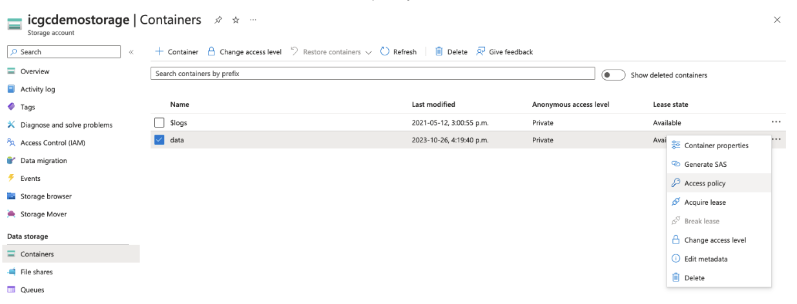

# Storage Provider Setup

To set up your object storage for Score:

1. **Register with a provider** of your choice and follow their instructions for setting up and configuring their service.

<Note title="Minio Local Quickstart">If you'd like to quickly spin up a compatible object storage locally, you can run the following command: `docker run --name minIO -p 9000:9000 -e MINIO_ACCESS_KEY=minio -e MINIO_SECRET_KEY=minio123 minio/minio:RELEASE.2018-05-11T00-29-24Z server /data`</Note>

2. **Create two data buckets for Score** to use:

- A bucket to store object data
- A bucket to store and maintain state information

<Warning>**Note:** After creation, remember the IDs of both buckets, they will be required later for configuring Score.</Warning>

3. You may need to **create a `/data` sub-folder** in advance for each bucket. This requirement will depend on your storage provider and is summarized below:

| Storage Provider | Data sub-folder required |
|--|--|
| Amazon S3 | No |
| Microsoft Azure | No |
| MinIO | No |
| OpenStack with Ceph | Yes |

4. **Record the URL, access key and secret key** used to access your storage service. These will be required later for configuring Score.  **Keep these values safe and secure**.

<Note title="For Amazon S3 buckets">Remember to document the geographical region where you have configured your buckets to be stored, this will be required when configuring Score.</Note>

# Environment Variable Setup

Once your object storage is established, the next step involves configuring Score for connection. The specific configuration settings will vary based on your object storage provider. Below are the detailed setup instructions.

## AWS, Ceph, or Minio

To connect Score with AWS, Ceph, or Minio storage, modify your `.env.score` file as follows:

```bash
# ============================
# Object Storage Configruation Variables
# ============================

SPRING_PROFILES_ACTIVE=prod,aws

S3_ENDPOINT="http://localhost:9000"
S3_ACCESS_KEY="minio"
S3_SECRETKEY="minio123"
S3_SIGV4ENABLED="true"

BUCKET_NAME_OBJECT="object.bucket"
BUCKET_NAME_STATE="state.bucket"
BUCKET_SIZE_POOL=0
BUCKET_SIZE_KEY=2

UPLOAD_PARTSIZE=1048576
UPLOAD_RETRY_LIMIT=10
UPLOAD_CONNECTION_TIMEOUT=60000
UPLOAD_CLEAN_CRON="0 0 0 * * ?"
UPLOAD_CLEAN_ENABLED="true"
```

The following table summarizes the necessary variables:

| Setting               | Requirement | Description |
|-----------------------|-------------|-------------|
| `S3_ENDPOINT`         | Required    | API endpoint URL of your storage service. Score will communicate with the service via this URL. |
| `S3_ACCESSKEY`        | Required    | Access key for your object storage buckets. |
| `S3_SECRETKEY`        | Required    | Secret key for your object storage buckets. |
| `S3_SIGV4ENABLED`     | Required    | Set to `true` if using AWS S3 [Signature Version 4](https://docs.aws.amazon.com/general/latest/gr/signature-version-4.html) for authentication. Otherwise, set to `false`. |
| `BUCKET_NAME_OBJECT`  | Required    | ID of the bucket for storing object data. |
| `BUCKET_NAME_STATE`   | Required    | ID of the bucket for storing state information.  |
| `BUCKET_SIZE_POOL`   | Required    | DESCRIPTION  |
| `BUCKET_SIZE_KEY`   | Required    | DESCRIPTION |
| `UPLOAD_PARTSIZE`     | Required    | Byte size of each upload chunk to the object storage. Adjust for performance. |
| `UPLOAD_RETRY_LIMIT`  | Required    | Retry attempts for failed uploads before aborting. |
| `UPLOAD_CONNECTION_TIMEOUT` | Required | Timeout duration in milliseconds for idle connections. |
| `UPLOAD_CLEAN_CRON`   | Optional    | Schedule for the cleanup cron job, if enabled. |
| `UPLOAD_CLEAN_ENABLED`| Optional    | Set to `true` for enabling the cleanup cron job. |


## Azure

For connecting Score with Azure storage, update `.env.score` as shown:

```bash

SPRING_PROFILES_ACTIVE=prod,azure

AZURE_ENDPOINT_PROTOCOL=https
AZURE_ACCOUNT_NAME={{storage_account_name}}
AZURE_ACCOUNT_KEY={{storage_account_secret_key}}

BUCKET_NAME_OBJECT={{object_bucket}} # Object data storage bucket/container name
BUCKET_POLICY_UPLOAD={{write_policy}} # Access policy name for write operations
BUCKET_POLICY_DOWNLOAD={{read_policy}} # Access policy name for read operations

UPLOAD_PARTSIZE=104587
DOWNLOAD_PARTSIZE=250000000 # Default part size for downloads

OBJECT_SENTINEL=heliograph # Required sample object/file name for `ping` operations; default is `heliograph
```

The following table summarizes the Azure-specific variables:

| Setting                  | Requirement | Description |
|--------------------------|-------------|-------------|
| `AZURE_ENDPOINT_PROTOCOL`| Required    | Communication protocol for the Azure storage API endpoint (e.g., `https`). |
| `AZURE_ACCOUNT_NAME`     | Required    | Account name for accessing Azure object storage. |
| `AZURE_ACCOUNT_KEY`      | Required    | Account key for accessing Azure object storage. |
| `BUCKET_NAME_OBJECT`     | Required    | Bucket ID for storing object data. |
| `BUCKET_POLICY_UPLOAD`   | Required    | Access policy name for write operations. |
| `BUCKET_POLICY_DOWNLOAD` | Required    | Access policy name for read operations. |
| `UPLOAD_PARTSIZE`        | Required    | Byte size of each upload chunk. Adjust for performance. |
| `DOWNLOAD_PARTSIZE`      | Required    | Byte size of each download chunk. Adjust for performance. |
| `OBJECT_SENTINEL`        | Required    | Default sample object/file name for `ping` operations. |

### Access Policy Configuration for Azure

For Azure storage, you must define a storage access policy for your container.

1. **Access the Azure dashboard:** Select containers from the left-hand menu.
2. **Locate your container:** Choose `Access Policy` from the dropdown menu.

   

3. **Create `write` and `readonly` access policies:**

   

<Note title="Azure storage access policies">For more information on Azure storage access policies, visit [the official Azure storage services documentation](https://learn.microsoft.com/en-us/rest/api/storageservices/define-stored-access-policy#create-or-modify-a-stored-access-policy").</Note>
