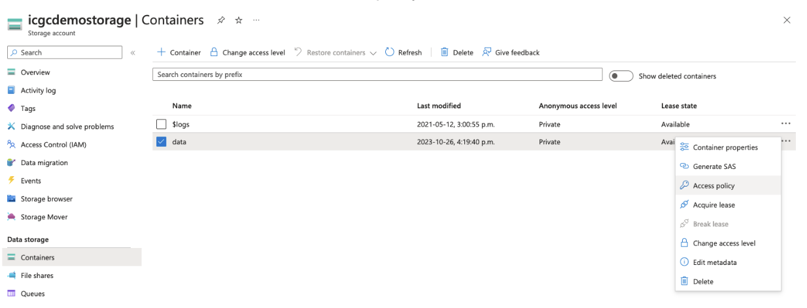
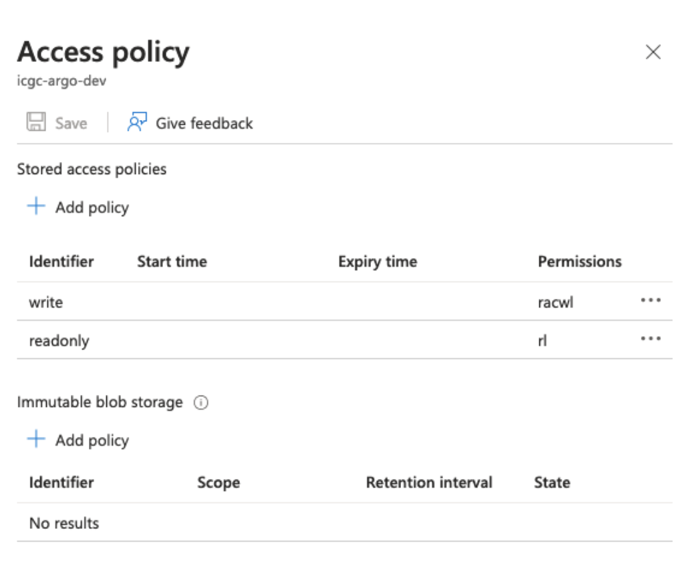

After you've set up your object storage, the next step is to configure Score for connection. The precise configuration settings will vary based on your object storage provider. Detailed setup information is provided below.
## AWS, Ceph, or Minio

To link Score to AWS, Ceph, or Minio storage, modify your `.env.score` file as follows:

```bash
# Prod profile configuration
SPRING_PROFILES_ACTIVE=prod,aws

S3_ENDPOINT="http://localhost:9000"
S3_ACCESS_KEY="abc123"
S3_SECRETKEY="abc123"
S3_SIGV4ENABLED="true"

BUCKET_NAME_OBJECT="test_object_bucket"
BUCKET_NAME_STATE="test_state_bucket"
BUCKET_SIZE_POOL=0
BUCKET_SIZE_KEY=2

UPLOAD_PARTSIZE=1048576
UPLOAD_RETRY_LIMIT=10
UPLOAD_CONNECTION_TIMEOUT=60000
UPLOAD_CLEAN_CRON="0 0 0 * * ?"
UPLOAD_CLEAN_ENABLED="true"

```

The table below summarizes the variables you need to set:

| Setting | Requirement | Description |
|---------|-------------|-------------|
| `S3_ENDPOINT` | Required | The URL of the storage service's API endpoint. Score will send requests to this URL when interacting with the service's API. |
| `S3_ACCESSKEY` | Required | The access key required to access the buckets in your object storage. This should have been recorded during your prerequisite setup. |
| `S3_SECRETKEY` | Required | The secret key required to access the buckets in your object storage. This should have been recorded during your prerequisite setup. |
| `S3_SIGV4ENABLED` | Required | If your storage service uses the AWS S3 <a href="https://docs.aws.amazon.com/general/latest/gr/signature-version-4.html" target="_blank" rel="noopener noreferrer">Signature Version 4</a> signing process for authentication, set this to `true`.  Else set this to `false`. |
| `BUCKET_NAME_OBJECT` | Required | The ID of the bucket used to store object data for Score. This should have been recorded during your prerequisite setup. |
| `BUCKET_NAME_STATE` | Required | The ID of the bucket used to store and maintain state information for Score. This should have been recorded during your prerequisite setup. |
| `UPLOAD_PARTSIZE` | Required | The size, expressed in bytes, of each part or chunk to upload at once to the object storage.  You can use this parameter to adjust for your desired speed and performance. |
| `UPLOAD_RETRY_LIMIT` | Required | Number of times that Score will retry failed upload requests to the object storage before aborting. |
| `UPLOAD_CONNECTIONTIMEOUT` | Required | Number of milliseconds that Score will wait on a stale or idle connection to the object storage before timing out. |
| `UPLOAD_CLEAN_CRON` | Optional | If `CLEAN_ENABLED` = `true`, use this parameter to configure the schedule on which the cleanup cron job runs. The cleanup job cleans up old upload jobs, between Score and the object storage. |
| `UPLOAD_CLEAN_ENABLED` | Optional | Set to `true` if you want to run a cron job that cleans up old upload jobs between Score and the object storage.  If `true`, the cron schedule can be set with the `CLEAN_CRON` parameter.  Else set this value `false` if you do not want any cleanup. |
| `OBJECT_SENTINEL` | Required | The name of the sample object/file that must exist in object storage for Score to perform `ping` operations.  Default is `heliograph.` |

## Azure

To link Score to Azure storage, modify your `.env.score` file as follows:

```shell
# Azure profile configuration
SPRING_PROFILES_ACTIVE=prod,azure

AZURE_ENDPOINT_PROTOCOL="https"
AZURE_ACCOUNT_NAME="{{storage_account_name}}"
AZURE_ACCOUNT_KEY="{{storage_account_secret_key}}"

BUCKET_NAME_OBJECT="{{object_bucket}}" # Name of the bucket or container that will store the object data
BUCKET_POLICY_UPLOAD="{{write_policy}}" # Name of the access policy to use for write/add/modify operations
BUCKET_POLICY_DOWNLOAD="{{read_policy}}" # Name of the access policy for the read/list operations

UPLOAD_PARTSIZE=104587
DOWNLOAD_PARTSIZE=250000000 # Safe default part size for downloads

OBJECT_SENTINEL="heliograph" # Score requires a sample object/file to exist in the object storage for `ping` operations; default is `heliograph`
```

The table below summarizes the variables you need to set:

| Setting | Requirement | Description |
|---------|-------------|-------------|
| `AZURE_ENDPOINTPROTOCOL` | Required | The communication protocol used by the Azure storage service's API endpoint. For example, `https`. |
| `AZURE_ACCOUNTNAME` | Required | Account name required to access your Azure object storage. This should have been recorded during your prerequisite setup. |
| `AZURE_ACCOUNTKEY` | Required | Account key required to access your Azure object storage. This should have been recorded during your prerequisite setup. |
| `BUCKET_NAME_OBJECT` | Required | ID of the bucket used to store object data for Score. This should have been recorded during your prerequisite setup. |
| `BUCKET_POLICY_UPLOAD` | Required | The name of the access policy to use for write/add/modify operations. |
| `BUCKET_POLICY_DOWNLOAD` | Required | Name of the access policy for the read/list operations. |
| `UPLOAD_PARTSIZE` | Required | Size, expressed in bytes, of each part or chunk to upload at once to the object storage. You can use this parameter to adjust for your desired speed and performance. |
| `DOWNLOAD_PARTSIZE` | Required | Size, expressed in bytes, of each part or chunk to download at once from the object storage. You can use this parameter to adjust for your desired speed and performance. |
| `OBJECT_SENTINEL` | Required | The name of the sample object/file that must exist in object storage for Score to perform `ping` operations. Default is `heliograph.` |

### Access Policy Configuration

If using Azure, you must define a storage access policy for your container. 

1. **Access the Azure dashboard:** from the lefthand menu, select containers


2. **Locate the container of interest:** from the dropdown menu, select `Access Policy`



3. **Create the following** `write` and `readonly` access policies for the container:



<Note title="Azure storage access policies">For more information on Azure storage access policies, see [the official Azure storage services documentation](https://learn.microsoft.com/en-us/rest/api/storageservices/define-stored-access-policy#create-or-modify-a-stored-access-policy")</Note>
