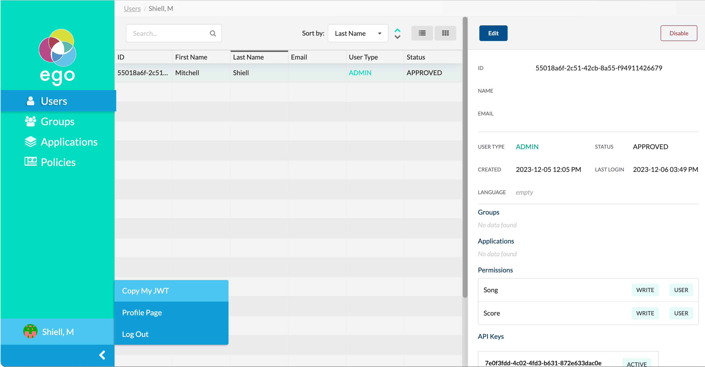

This guide provides detailed instructions for setting up the core Overture microservices locally on MacOs.

# OAuth Setup

Ego will be set up first as it will be brokering authorization tokens that will allow Overture services to communicate securely.

## Install Docker and PostgreSQL:

- Install [Docker Desktop](https://www.docker.com/products/docker-desktop)
- Install [PostgreSQL](https://www.postgresql.org/download/)
- For database configuration this guide uses [PgAdmin4](https://www.pgadmin.org/download/)

## Database configuration (PgAdmin4)

1. **Create and name your server:** from the top navigation menu, select `Object > Create > Server-Group`. Input a name (e.g. `overture`) and click `save`.


2. **Create your server group:** Right-click your server, choose `Create > Server Group`, and choose a name (e.g. `overtureDbs`). This group will contain all databases needed for Ego and Song.


3. **Set hostname and port:**Right-click `overtureDbs` and select `Properties`. In the Connection tab, ensure your hostname/address is `localhost` and the port is `5432`.


4. **Create a Databases for Ego:** Right-click `Databases`, then `Create > Database`. For simplicity name your database `egoDb` and click `Save`.

## Set up identity providers (Google)


1. **Create an account with <a href="https://console.developers.google.com/" target="_blank" rel="noopener noreferrer">Google Developer Console</a>:** If you don't already have one. If you are an individual working alone with the Overture suite, you may use a personal account. However, if you work for a larger organization or institution, consult your IT department for a designated account.


2. **Log into Google Developer Console:**  Sign in to your Google Developer Console account.


3. **Select or Create a Project:** Go to **Dashboard** and select the existing project where you want your application to exist or create a new one.


4. **Register your Application:** Go to the **OAuth consent screen** to register your application with your project.  Only one app can be registered per project.


5. **Select User Type:** Choose the appropriate **User Type**:

- **Internal:** Limits the app to users within your Google Workspace if you are part of one. |
- **External:** Makes the app available to any test user with a Google account. The app starts in testing mode.

<Warning>**NOTE:** The **External** configuration is typically recommended, especially if you intend for external users to access and use your app.</Warning>


6. **Click Create:** Click on **Create** to proceed.


7. **Fill in App Information:**  Provide the following details under **App Information**:

- **App name:** Name for the app requiring consent.
- **User support e-mail:** For users to contact you with questions about their consent.


8. **Add Authorized Domains and Developer Contact Information:** If you plan to deploy your app to a specific domain, add the domain under **Authorized Domains**. Then under **Developer Contact Information**, enter an e-mail address for Google to notify you of any changes to your project:


9. **Set up Credentials:** Go to **Credentials** to set up your client ID and secret.  Click **Create Credentials** and select **OAuth client ID**:


10. **Enter Information:** Provide the following information:

- **Application type:** Set to `Web application`
- **Name:** Enter a name for the client

11. **Add Authorized Redirect URIs:** Under Under **Authorized redirect URIs**, add a URI. This is the URI where Google will redirect users once they have authenticated with the provider. The URI should be in the following format:

`<url>/oauth/login/google`

In this case replace `<url>` with the base URL `http://localhost:8081/oauth/code/google`

12. **Click Create:** Click on **Create** to proceed:


*Update this image*

13. **Copy Client ID and Client Secret:** The credentials for your app will be created, and the **Client ID** and **Client Secret** will be displayed. Make sure to copy and securely store these values. You can always access and view these values in the Google Developer Console by viewing your OAuth Client ID details.

<Warning> **Note:** For detailed instructions on setting up other OAuth providers including GitHub, LinkedIn and ORCiD [see our docs here](https://www.overture.bio/documentation/ego/installation/prerequisites/#setting-up-identity-provider-secrets).</Warning>


## Configure and Run Ego

1. **Create the Ego configuration file:** Create an environment variable file and name it `.env.ego`. Copy and paste the following template:


```env
# Active Profiles (only auth needed)

SPRING_PROFILES_ACTIVE=auth

# Google OAuth Credentials

SPRING_SECURITY_OAUTH2_CLIENT_REGISTRATION_GOOGLE_CLIENTID={{Client-ID}}
SPRING_SECURITY_OAUTH2_CLIENT_REGISTRATION_GOOGLE_CLIENTSECRET={{Client-Secret}}

# Database Connection variables

SPRING_DATASOURCE_URL=jdbc:postgresql://host.docker.internal:5432/egoDb
SPRING_DATASOURCE_USERNAME={{ Postgres Username }}
SPRING_DATASOURCE_PASSWORD={{ Postgress Password }}

# Ego Admin UI variables

INITIALIZATION_ENABLED=true
INITIALIZATION_APPLICATIONS_0_NAME=Ego UI
INITIALIZATION_APPLICATIONS_0_TYPE=CLIENT
INITIALIZATION_APPLICATIONS_0_CLIENTID=ego-ui
INITIALIZATION_APPLICATIONS_0_CLIENTSECRET=anything
INITIALIZATION_APPLICATIONS_0_REDIRECTURI=http://localhost:3501
INITIALIZATION_APPLICATIONS_0_DESCRIPTION=initial app for ego ui

DEFAULT_USER_FIRST_USER_AS_ADMIN=true
DEFAULT_USER_TYPE=USER
DEFAULT_USER_STATUS=APPROVED
```

2. **Update the following variables:**


   | Field | Description |
   |---|---|
   | `SPRING_SECURITY_OAUTH2_CLIENT_REGISTRATION_GOOGLE_CLIENTID` | Update this field with your google `client-ID` |
   | `SPRING_SECURITY_OAUTH2_CLIENT_REGISTRATION_GOOGLE_CLIENTSECRET` | Update this field with your google `client secret`  |
   | `SPRING_DATASOURCE_URL` | If your your database is named `egoDb` and is running on port `5432` you can keep this value as is. Otherwise you will need to update this value accordingly.   |
   | `SPRING_DATASOURCE_USERNAME` | Input your postgres username |
   | `SPRING_DATASOURCE_PASSWORD` | Input your postgres password  |
   
   
3. **Run Ego with Docker:** from the directory of your `.env.ego` file run the following docker command:


   ```bash
   docker run --name Ego --env-file .env.ego -d -p 8081:8081 ghcr.io/overture-stack/ego:edge
   ```

If successful you should see the following message: 

```bash
2024-01-12 22:08:03,146 [main] INFO  b.o.e.AuthorizationServiceMain - Started AuthorizationServiceMain in 65.278 seconds (JVM running for 70.594)
```

Ego's API endpoints will be accessible from its Swagger UI found at `http://localhost:8081/swagger-ui.html` and a series of new tables will be populated in your database. Data tables can be viewed within gAdmin under `egoDb > Schemas > Tables`. There should be 16 tables.


<Warning>**Need Help?** We are happy to provide support over at the [Overture Slack Channel](https://join.slack.com/t/overture-bio/shared_invite/zt-21tdumtdh-9fP1TFeLepK4~Lc377rOYw).</Warning>

## Configure and Run the Ego Admin UI

1. **Create the Ego-UI configuration file:** Create a new environment variable file and name it `.env.egoui`. Copy and paste the following information:


   ```ENV
   REACT_APP_API=http://localhost:8081
   REACT_APP_EGO_CLIENT_ID=ego-ui
   ```

2. **Run Ego-UI with Docker:** from the directory of your `.env.egoui` file run the following docker command:

```bash
docker run --name ego-ui --env-file .env.egoui -d -p 3501:8080 ghcr.io/overture-stack/ego-ui:edge
```

If successful you should see the following message: 

```bash
INFO: Accepting connections at http://localhost:8080
```

The Ego UI should now be accessible from your `http://localhost:3501`

<Note title="8080 vs 3501?"> **Get explaination**. The Redirect URI for the Ego Admin UI was defined from within the .env.ego under `INITIALIZATION_APPLICATIONS_0_REDIRECTURI=http://localhost:3501`.  </Note>

3. **Log in to the Admin UI:** Go to `http://localhost:3501` and log in with your Google account. The first user logged into the Ego admin UI is designated by default as an ADMIN user and is therefore able to apply permissions to users and applications.

## Set up application permissions

1. **Open the Application dashboard:** Expand the left-hand navigation pane by clicking the chevron on the bottom left and select **Applications**


2. **Select Create:** Populate the input fields as follows and click **Save**


| Field | Value |
|---|---|
| Name | song-api |
| Status | APPROVED |
| Application Type | ADMIN |
| Client ID | song-api |
| Client Secret | abc123 |
| Redirect URI | "" |
| Error Redirect URI | "" |


3. **Repeat for Score:** While we are here let's create the score-api entity. Populate the input fields as follows and click **Save**


| Field | Value |
|---|---|
| Name | score-api |
| Status | APPROVED |
| Application Type | ADMIN |
| Client ID | score-api |
| Client Secret | abc123 |
| Redirect URI | "" |
| Error Redirect URI | "" |


4. **Create the application Policies:** From the left-hand navigation select **Policies**. Click **Create** from the top right panel. Name this policy `SONG` click save and repeat this process for `SCORE`.


5. **Create a new group:** From the left-hand navigation select **Groups**. Click **Create** from the top right panel. For this example we have named this group `DataProviders`. Under **Permissions** click the **+ Add** button and include both the newly created `SONG` and `SCORE` policies, set both with write permissions. Under **Users** click the **+ Add** button and select your alias. Click **Save**

## Generate an API Key

1. **Retrieve your JWT** Log into the Ego-UI, and from the profile menu found in on the bottom of the left-hand panel select, **Copy My JWT**, store this value for later.



Next, we will use the Ego API to generate an API Key with `WRITE` access for both Song and Score.

2. **Copy your user ID:** From the Ego Admin UI users tab select your user record and copy and save the `ID` value.


3. **Open Ego's Swagger UI:** Ego's swagger UI can be accessed from `http://localhost:8081/swagger-ui.html`.


4. **Authorize:** In the top right, click the **Authorize** button (open lock icon). A dialog appears asking you to authorize with the API.  In the `Value` box, enter `bearer` followed by your JWT. Click **Authorize** and then **close**.


6. **Locate the issue API Key Endpoint:** Under the **API Keys** section, click the `POST` endpoint called `issueApiKey`.  The endpoint input parameters are displayed:


7. **Enter your information:** Click **Try it out**.  You can now enter the parameters needed to generate the API Key:

| Param | Description |
|-------|-------------|
| `description` | Optional description of the API Key being generated. |
| `scopes` | Enter the specific scopes or permissions to grant for this API Key.  We will add an entry for `SONG.WRITE` and `SCORE.WRITE`. |
| `user_id` | Insert the User ID you copied earlier |


8. **Generate your API Key:** Click **Execute**.  If successful, the **responses** section will show a response indicating the API Key was generated. Copy the value displayed within the `name` variable, this is your API Key.

```shell
{
  "name": "1a1a72a4-224f-41a0-9825-c0dacadba228",
  "scope": [
    "SONG.WRITE",
    "SCORE.WRITE"
  ],
  "expiryDate": "2021-05-06T01:42:35.228+0000",
  "issueDate": "2021-04-06T01:42:35.228+0000",
  "isRevoked": false,
  "description": null
}
```

<Note title="Accessing your API Key"> API keys are also recored within the Ego Admin UI and found from your user information pane.</Note>

# Metadata Manager Setup


## Run Song Dependent services (Kafka and Zookeeper)

1. **Create the docker-compose:** From the same directory as your `.env` files create a new file title `docker-compose.yml` and copy and paste the following:

```yml
version: '2'
services:
  zookeeper:
    image: confluentinc/cp-zookeeper:latest
    environment:
      ZOOKEEPER_CLIENT_PORT: 2181
      ZOOKEEPER_TICK_TIME: 2000
    ports:
      - 22181:2181
  
  kafka:
    image: confluentinc/cp-kafka:latest
    depends_on:
      - zookeeper
    ports:
      - 29092:29092
      - 9092:9092
    environment:
      KAFKA_BROKER_ID: 1
      KAFKA_ZOOKEEPER_CONNECT: zookeeper:2181
      KAFKA_ADVERTISED_LISTENERS: PLAINTEXT://host.docker.internal:9092,PLAINTEXT_HOST://localhost:29092
      KAFKA_LISTENER_SECURITY_PROTOCOL_MAP: PLAINTEXT:PLAINTEXT,PLAINTEXT_HOST:PLAINTEXT
      KAFKA_INTER_BROKER_LISTENER_NAME: PLAINTEXT
      KAFKA_OFFSETS_TOPIC_REPLICATION_FACTOR: 1
```

2. **Run Docker Compose:** Save and run the command `docker compose up`

Once completed you should be able to see Zookeeper and Kafka running from your Docker Desktop containers tab or typing `docker ps` from the command line.

## Create Songs Database (PgAdmin4)

1. **Create a Databases for Song:** Right-click `Databases`, then `Create > Database`. For simplicity name your database `songDb` and click `Save`.

## Running Song

1. **Create the Song configuration file:** Create a new environment variable file and name it `.env.song`. Copy and paste the following information:

```ENV

# ============================
# Database Configuration
# ============================

# PostgreSQL JDBC connection details
SPRING_DATASOURCE_URL=jdbc:postgresql://host.docker.internal:5432/songDb?stringtype=unspecified
SPRING_DATASOURCE_USERNAME={{ postgres username }}
SPRING_DATASOURCE_PASSWORD={{ postgres password }}
# Flyway migration settings
SPRING_FLYWAY_ENABLED=true
SPRING_FLYWAY_LOCATIONS=classpath:flyway/sql,classpath:db/migration

# ============================
# Spring Run Profiles
# ============================

# Active profiles to determine app behavior & configs
SPRING_PROFILES_ACTIVE=secure,score-client-cred,kafka

# ============================
# Ego Integration
# ============================

AUTH_SERVER_URL=http://host.docker.internal:8081/o/check_api_key/
AUTH_SERVER_CLIENTID=song-api
AUTH_SERVER_CLIENTSECRET=abc123
AUTH_SERVER_TOKENNAME={{API Token}}
AUTH_SERVER_SCOPE_STUDY_PREFIX=song.
AUTH_SERVER_SCOPE_STUDY_SUFFIX=.WRITE
AUTH_SERVER_SCOPE_SYSTEM=song.WRITE
SPRING_SECURITY_OAUTH2_RESOURCESERVER_JWT_PUBLIC_KEY_LOCATION=http://host.docker.internal:8081/oauth/token/public_key

# ============================
# Score Integration
# ============================

SCORE_URL=http://host.docker.internal:8087
SCORE_CLIENTCREDENTIALS_ID=score-api
SCORE_CLIENTCREDENTIALS_SECRET=abc123
SCORE_CLIENTCREDENTIALS_TOKENURL=http://localhost:8087/oauth/token
SCORE_CLIENTCREDENTIALS_SYSTEMSCOPE=score.WRITE

# ============================
# ID Management configuration 
# ============================

ID_USELOCAL=true

# ============================
# Schema Strictness Configuration 
# ============================

SCHEMAS_ENFORCELATEST=true

# ============================
# Kafka Event Management Configuration 
# ============================

SPRING_KAFKA_BOOTSTRAP-SERVERS=http://localhost:29092/
SPRING_KAFKA_TEMPLATE_DEFAULT-TOPIC=song-analysis
```

3. **Update Environment Variables Accordingly:** You will need to update `AUTH_SERVER_TOKENNAME` with your API Token, and supply your `postgres username` and `password`. Assuming you have not deviated from the naming conventions outlined above all other variables are pre-configured. 


2. **Run Song with Docker:** from the directory of your `.env.song` file run the following docker command:

```bash
docker run --env-file .env -p 8080:8080 ghcr.io/overture-stack/song-server:latest
```

If successful you should see the following message: 

```bash
2024-01-15 21:48:34,808 [main] INFO  b.o.s.s.ServerMain - Started ServerMain in 71.623 seconds (JVM running for 76.92)
```

Song should now be accessible from your `http://localhost:8080/swagger-ui.html#/`

# Setting Up File Transfer and Object Storage

## Object Storage

Add Info

## Running Score

1. **Create the Score configuration file:** Create a new environment variable file and name it `.env.score`. Copy and paste the following information:

```ENV
# ============================
# Spring Run Profiles (Required)
# ============================

# Active profiles to determine app behavior & configs
SPRING_PROFILES_ACTIVE=collaboratory,prod,secure

# Server configuration
SERVER_PORT=8087
SERVER_SSL_ENABLED=false

# Logging
LOGGING_LEVEL_ORG_SPRINGFRAMEWORK_WEB=INFO
LOGGING_LEVEL_BIO_OVERTURE_SCORE_SERVER=INFO
LOGGING_LEVEL_ROOT=INFO

# ============================
# Server Authentication integration (Required)
# ============================
AUTH_SERVER_URL=http://host.docker.internal:9082/o/check_api_key/
AUTH_SERVER_TOKENNAME=apiKey
AUTH_SERVER_CLIENTID=score
AUTH_SERVER_CLIENTSECRET=abc123
AUTH_SERVER_SCOPE_STUDY_PREFIX=score.
AUTH_SERVER_SCOPE_UPLOAD_SUFFIX=.WRITE
AUTH_SERVER_SCOPE_DOWNLOAD_SUFFIX=.READ
AUTH_SERVER_SCOPE_DOWNLOAD_SYSTEM=score.WRITE
AUTH_SERVER_SCOPE_UPLOAD_SYSTEM=score.READ


# ============================
# Song Integration (Required)
# ============================
METADATA_URL=http://host.docker.internal:8080


# ============================
# Storage Integration (Required)
# ============================
S3_ENDPOINT=http://host.docker.internal:8085
S3_ACCESSKEY=minio
S3_SECRETKEY=minio123
S3_SIGV4ENABLED=true
OBJECT_SENTINEL=heliograph
BUCKET_NAME_OBJECT=oicr.icgc.test
BUCKET_NAME_STATE=oicr.icgc.test
COLLABORATORY_DATA_DIRECTORY=data
UPLOAD_PARTSIZE=1073741824
UPLOAD_CONNECTION_TIMEOUT=1200000
```

2. **Run Score with Docker:** from the directory of your `.env.score` file run the following docker command:

```bash
docker run --name score --env-file .env.score -d -p 8087:8087  ghcr.io/overture-stack/score-server:latest
```

**Note to self:** Oddly it exits out and gives a hash immediately however the container is running and you can watch it deploy within the logs on docker desktop. The message below is what i see in the terminal following the command.

```bash
WARNING: The requested image's platform (linux/amd64) does not match the detected host platform (linux/arm64/v8) and no specific platform was requested
c28ec2895c1ecf25bcc179c43c683866010cdeee4292607978227245a37f31d7
```

If successful you should see the following message: 

```bash
2024-01-15 22:40:54.114 INFO 8 --- [main] bio.overture.score.server.ServerMain: Started ServerMain in 50.423 seconds (JVM running for 54.435)
```

Score should now be running with the swagger-ui accessible from: http://localhost:8087/swagger-ui.html#/

# Search API Setup

## Run Arranger-server

1. Clone the Arranger repository from your command line terminal:

```bash
git clone https://github.com/overture-stack/arranger.git
```

2.  Navigate to the project directory:

```bash
cd arranger
```

3. With Docker running, execute the quickstart `make` target:

```bash
make start
```

The default index mapping, called `file_centric_1.0`, is a sample mapping used for cancer genomics. It represents the structure of genomic file metadata that can be searched using Arranger. In Arranger, the sample mapping is configured in the `index_config.json` file, and can be viewed from the GitHub repository here.

4. To set up Arranger with this example mapping, run the following make command:

```bash
make seed-es
```

#  Indexing Service Setup

## Configure and run Maestro

1. **Create the Maestro configuration file:** Create a new environment variable file and name it `.env.maestro`. Copy and paste the following information:

```ENV
# ============================
# Server configuration
# ============================

LOGGING_LEVEL_ROOT=DEBUG
SERVER_PORT=11235
SPRING_MVC_ASYNC_REQUESTTIMEOUT=-1
MAESTRO_FAILURELOG_DIR=/app/app-data
MAESTRO_NOTIFICATIONS_SLACK_ENABLED=false

# ============================
# Elasticseach Integration (Required)
# ============================

MAESTRO_ELASTICSEARCH_CLIENT_BASICAUTH_ENABLED=true
MAESTRO_ELASTICSEARCH_CLIENT_BASICAUTH_PASSWORD=myelasticpassword
MAESTRO_ELASTICSEARCH_CLIENT_BASICAUTH_USER=elastic
MAESTRO_ELASTICSEARCH_CLIENT_CONNECTIONTIMEOUT=300000
MAESTRO_ELASTICSEARCH_CLIENT_SOCKETTIMEOUT=300000
MAESTRO_ELASTICSEARCH_CLIENT_TRUSTSELFSIGNEDCERT=true
MAESTRO_ELASTICSEARCH_CLUSTERNODES_0=http://host.docker.internal:9200
MAESTRO_ELASTICSEARCH_INDEXES_ANALYSISCENTRIC_ENABLED=false
MAESTRO_ELASTICSEARCH_INDEXES_FILE_CENTRIC_NAME=file_centric_1.0

# ============================
# Song Integration (Required)
# ============================

MAESTRO_REPOSITORIES_0_CODE=song.collab
MAESTRO_REPOSITORIES_0_COUNTRY=CA
MAESTRO_REPOSITORIES_0_NAME=local song
MAESTRO_REPOSITORIES_0_ORGANIZATION=overture
MAESTRO_REPOSITORIES_0_URL=http://host.docker.internal:8080
MAESTRO_SONG_PAGELIMIT=50
MAESTRO_SONG_TIMEOUTSEC_ANALYSIS=3600
MAESTRO_SONG_TIMEOUTSEC_STUDY=3600

# ============================
# Kafka Event Management Configuration
# ============================

SPRING_CLOUD_STREAM_KAFKA_BINDER_BROKERS=host.docker.internal:9092
SPRING_CLOUD_STREAM_BINDINGS_SONGINPUT_DESTINATION=song_analysis
```

2. **Run Maestro with Docker:** from the directory of your `.env.maestro` file run the following docker command:
e
```bash
docker run --env-file .env.maestro -p 11235:11235 --name maestro ghcr.io/overture-stack/maestro:edge
```

If successful you should see: **Note to self:** need explaination here

```bash
2024-01-16 | 14:34:32.531 | 1 | KafkaConsumerDestination{consumerDestinationName='song_analysis', partitions=1, dlqName='maestro_song_analysis_dlq'}.container-0-C-1 | DEBUG | org.springframework.kafka.listener.KafkaMessageListenerContainer | Commit list: {}
2024-01-16 | 14:34:33.520 | 1 | KafkaConsumerDestination{consumerDestinationName='maestro_index_requests', partitions=1, dlqName='maestro_index_requests_dlq'}.container-0-C-1 | DEBUG | org.springframework.kafka.listener.KafkaMessageListenerContainer | Received: 0 records
```

# Data Portal Setup

## Configure and run the DMS-UI

1. Clone the DMS-UI repository to your machine

```BASH
git clone https://github.com/overture-stack/dms-ui.git
```

2. Update the ``.env.local` file:

```ENV
######### Ego
# Base url for Ego API
NEXT_PUBLIC_EGO_API_ROOT=http://localhost:8081
# Ego registered app id
NEXT_PUBLIC_EGO_CLIENT_ID=dms-ui

######### Arranger
NEXT_PUBLIC_ARRANGER_DOCUMENT_TYPE=file 
NEXT_PUBLIC_ARRANGER_INDEX=file_centric_1.0
NEXT_PUBLIC_ARRANGER_API_URL=http://localhost:5050/
# Columns are field names separated by commas, with or without quotes
# this is where you'd provide here the fields you want to use for manifest downloads
# NEXT_PUBLIC_ARRANGER_MANIFEST_COLUMNS=fieldName, "fieldName", 'fieldName'

######### DMS
NEXT_PUBLIC_SSO_PROVIDERS=GOOGLE

# ######## Optional features/functionalities
NEXT_PUBLIC_DEBUG=true

# Auth provider: ego or keycloak
NEXT_PUBLIC_AUTH_PROVIDER=ego
ACCESSTOKEN_ENCRYPTION_SECRET=super_secret
SESSION_ENCRYPTION_SECRET=this_is_a_super_secret_secret
```

3. Install the dependencies by running the following command:

```BASH
npm ci
```

<Warning>**Note:** Ensure you are using node version 20 or greater</Warning>

4. Once installed deploy the DMS-UI by running 

```BASH
npm run dev
```

Once complete you should be able to access the DMS-UI from your `localhost:3000`.


# Creating docker containers for postgres

update this here 

```bash
docker pull postgres
```

```bash
docker run --name postgres_container -e POSTGRES_PASSWORD=mysecretpassword -d -p 5432:5432 postgres
```

# MinIO 

```bash
docker run --name minIO -p 9000:9000 -e MINIO_ACCESS_KEY=minio -e MINIO_SECRET_KEY=minio123 minio/minio:RELEASE.2018-05-11T00-29-24Z server /data
```

Create object bucket and state bucket

# Setting up Song and score clients
