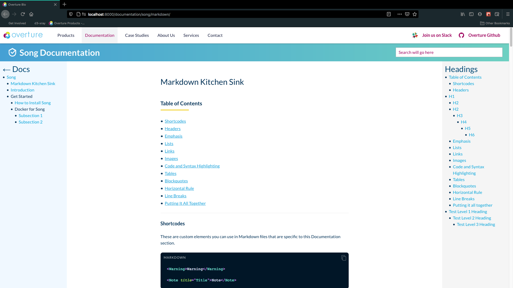

This is a "kitchen sink" file with all the possible Markdown elements.

Based on:

- <https://github.com/obedm503/markdown-kitchen-sink/blob/master/README.md>
- <https://pmarsceill.github.io/just-the-docs/docs/index-test/>
- <https://sourceforge.net/p/kitchensink/wiki/markdown_syntax/>

# Table of Contents

- [Shortcodes](#shortcodes)
- [Headers](#headers)
- [Emphasis](#emphasis)
- [Lists](#lists)
- [Links](#links)
- [Images](#images)
- [Large Images](#large-images)
- [Code and Syntax Highlighting](#code)
- [Tables](#tables)
- [Blockquotes](#blockquotes)
- [Horizontal Rule](#hr)
- [Line Breaks](#lines)
- [Putting It All Together](#all-together)

<a name="shortcodes"></a>

## Shortcodes

These are custom elements you can use in Markdown files that are specific to this Documentation section.

```
<Warning>Warning</Warning>

<Note title="Title">Note</Note>
```

<Warning>Warning</Warning>

<Note title="Title">Note</Note>

<a name="headers"></a>

## Headers

For the sake of good HTML structure, headings will be rendered one level lower. The page title is `H1`, so Markdown `H1`s will be rendered as `H2`, and so on.

```
# H1
## H2
### H3
#### H4
##### H5
###### H6

Alternatively, for H1 and H2, use underlines, but this won't affect the styling.

Alt-H1
======

Alt-H2
------
```

# H1

## H2

## H2

### H3

#### H4

##### H5

###### H6

Alternatively, for H1 and H2, an underline-ish style:

# Alt-H1

## Alt-H2

<a name="emphasis"></a>

## Emphasis

```no-highlight
Emphasis, aka italics, with *asterisks* or _underscores_.

Strong emphasis, aka bold, with **asterisks** or __underscores__.

Combined emphasis with **asterisks and _underscores_**.

Strikethrough uses two tildes. ~~Scratch this.~~
```

Emphasis, aka italics, with _asterisks_ or _underscores_.

Strong emphasis, aka bold, with **asterisks** or **underscores**.

Combined emphasis with **asterisks and _underscores_**.

Strikethrough uses two tildes. ~~Scratch this.~~

<a name="lists"></a>

## Lists

(In this example, leading and trailing spaces are shown with with dots: ⋅)

```no-highlight
1. First ordered list item
2. Another item
  * Unordered sub-list.
1. Actual numbers don't matter, just that it's a number
  1. Ordered sub-list
4. And another item.

   You can have properly indented paragraphs within list items. Notice the blank line above, and the leading spaces (at least one, but we'll use three here to also align the raw Markdown).

   To have a line break without a paragraph, you will need to use two trailing spaces.⋅⋅
   Note that this line is separate, but within the same paragraph.⋅⋅
   (This is contrary to the typical GFM line break behaviour, where trailing spaces are not required.)

* Unordered list can use asterisks
- Or minuses
+ Or pluses
```

1. First ordered list item
2. Another item
   - Unordered sub-list.
3. Actual numbers don't matter, just that it's a number
   1. Ordered sub-list
4. And another item.

   You can have properly indented paragraphs within list items. Notice the blank line above, and the leading spaces (at least one, but we'll use three here to also align the raw Markdown).

   To have a line break without a paragraph, you will need to use two trailing spaces.  
   Note that this line is separate, but within the same paragraph.  
   (This is contrary to the typical GFM line break behaviour, where trailing spaces are not required.)

- Unordered list can use asterisks

* Or minuses

- Or pluses

<a name="links"></a>

## Links

There are two ways to create links.

```no-highlight
[I'm an inline-style link](https://www.google.com)

[I'm an inline-style link with title](https://www.google.com "Google's Homepage")

[I'm a reference-style link][Arbitrary case-insensitive reference text]

[I'm a relative reference to a repository file](../blob/master/LICENSE)

[You can use numbers for reference-style link definitions][1]

Or leave it empty and use the [link text itself].

URLs and URLs in angle brackets will automatically get turned into links.
http://www.example.com or <http://www.example.com> and sometimes
example.com (but not on Github, for example).

Some text to show that the reference links can follow later.

[arbitrary case-insensitive reference text]: https://www.mozilla.org
[1]: http://slashdot.org
[link text itself]: http://www.reddit.com
```

[I'm an inline-style link](https://www.google.com)

[I'm an inline-style link with title](https://www.google.com "Google's Homepage")

[I'm a reference-style link][arbitrary case-insensitive reference text]

[I'm a relative reference to a repository file](../blob/master/LICENSE)

[You can use numbers for reference-style link definitions][1]

Or leave it empty and use the [link text itself].

URLs and URLs in angle brackets will automatically get turned into links.
http://www.example.com or <http://www.example.com> and sometimes
example.com (but not on Github, for example).

Some text to show that the reference links can follow later.

[arbitrary case-insensitive reference text]: https://www.mozilla.org
[1]: http://slashdot.org
[link text itself]: http://www.reddit.com

<a name="images"></a>

## Images

```no-highlight
Here's our logo (hover to see the title text):

Inline-style:


Reference-style:
![alt text][logo]

[logo]: https://github.com/adam-p/markdown-here/raw/master/src/common/images/icon48.png "Logo Title Text 2"
```

Here's our logo (hover to see the title text):

Inline-style:


Reference-style:
![alt text][logo]

[logo]: https://github.com/adam-p/markdown-here/raw/master/src/common/images/icon48.png 'Logo Title Text 2'

<a name="large-images"></a>

## Large Images



<a name="code"></a>

## Code and Syntax Highlighting

Code blocks are part of the Markdown spec, but syntax highlighting isn't. However, many renderers -- like Github's and _Markdown Here_ -- support syntax highlighting. Which languages are supported and how those language names should be written will vary from renderer to renderer. _Markdown Here_ supports highlighting for dozens of languages (and not-really-languages, like diffs and HTTP headers); to see the complete list, and how to write the language names, see the [highlight.js demo page](http://softwaremaniacs.org/media/soft/highlight/test.html).

```no-highlight
Inline `code` has `back-ticks around` it.
```

Inline `code` has `back-ticks around` it.

Blocks of code are either fenced by lines with three back-ticks <code>```</code>, or are indented with four spaces. I recommend only using the fenced code blocks -- they're easier and only they support syntax highlighting.

<pre lang="no-highlight"><code>```javascript
var s = "JavaScript syntax highlighting";
alert(s);
```
 
```python
s = "Python syntax highlighting"
print s
```
 
```
No language indicated, so no syntax highlighting. 
But let's throw in a &lt;b&gt;tag&lt;/b&gt;.
```
</code></pre>

```javascript
var s = 'JavaScript syntax highlighting';
alert(s);
```

```python
s = "Python syntax highlighting"
print s
```

```
No language indicated, so no syntax highlighting in Markdown Here (varies on Github).
But let's throw in a <b>tag</b>.
```

<a name="tables"></a>

## Tables

Tables aren't part of the core Markdown spec, but they are part of GFM and _Markdown Here_ supports them. They are an easy way of adding tables to your email -- a task that would otherwise require copy-pasting from another application.

```no-highlight
Colons can be used to align columns.

| Tables        | Are           | Cool  |
| ------------- |:-------------:| -----:|
| col 3 is      | right-aligned | $1600 |
| col 2 is      | centered      |   $12 |
| zebra stripes | are neat      |    $1 |

There must be at least 3 dashes separating each header cell.
The outer pipes (|) are optional, and you don't need to make the
raw Markdown line up prettily. You can also use inline Markdown.

Markdown | Less | Pretty
--- | --- | ---
*Still* | `renders` | **nicely**
1 | 2 | 3
```

Colons can be used to align columns.

| Tables        |      Are      |   Cool |
| ------------- | :-----------: | -----: |
| col 3 is      | right-aligned | \$1600 |
| col 2 is      |   centered    |   \$12 |
| zebra stripes |   are neat    |    \$1 |

There must be at least 3 dashes separating each header cell. The outer pipes (|) are optional, and you don't need to make the raw Markdown line up prettily. You can also use inline Markdown.

| Markdown | Less      | Pretty     |
| -------- | --------- | ---------- |
| _Still_  | `renders` | **nicely** |
| 1        | 2         | 3          |

<a name="blockquotes"></a>

## Blockquotes

```no-highlight
> Blockquotes are very handy in email to emulate reply text.
> This line is part of the same quote.

Quote break.

> This is a very long line that will still be quoted properly when it wraps. Oh boy let's keep writing to make sure this is long enough to actually wrap for everyone. Oh, you can *put* **Markdown** into a blockquote.
```

> Blockquotes are very handy in email to emulate reply text.
> This line is part of the same quote.

Quote break.

> This is a very long line that will still be quoted properly when it wraps. Oh boy let's keep writing to make sure this is long enough to actually wrap for everyone. Oh, you can _put_ **Markdown** into a blockquote.

<a name="hr"></a>

## Horizontal Rule

```
Three or more...

---

Hyphens

***

Asterisks

___

Underscores
```

Three or more...

---

Hyphens

---

Asterisks

---

Underscores

<a name="lines"></a>

## Line Breaks

My basic recommendation for learning how line breaks work is to experiment and discover -- hit &lt;Enter&gt; once (i.e., insert one newline), then hit it twice (i.e., insert two newlines), see what happens. You'll soon learn to get what you want. "Markdown Toggle" is your friend.

Here are some things to try out:

```
Here's a line for us to start with.

This line is separated from the one above by two newlines, so it will be a *separate paragraph*.

This line is also a separate paragraph, but...
This line is only separated by a single newline, so it's a separate line in the *same paragraph*.
```

Here's a line for us to start with.

This line is separated from the one above by two newlines, so it will be a _separate paragraph_.

This line is also begins a separate paragraph, but...  
This line is only separated by a single newline, so it's a separate line in the _same paragraph_.

(Technical note: _Markdown Here_ uses GFM line breaks, so there's no need to use MD's two-space line breaks.)

<a name="all-together"></a>

## Putting it all together

Veniam aliquip esse consectetur officia ad ullamco pariatur magna aute aliquip irure eiusmod eiusmod. Anim `cillum reprehenderit esse` irure non ea. **BOLD TEXT Officia do voluptate** elit ullamco esse _ITALIC TEXT laboris laborum_ nulla nostrud sit. `Mollit non incididunt Lorem enim.` Non consectetur [occaecat ut quis cillum](https://overture.bio) ea esse aliquip sit nisi reprehenderit. Nostrud sit incididunt anim fugiat Lorem.

> BLOCKQUOTE Officia duis do cillum et magna irure qui adipisicing. Nulla excepteur id cupidatat dolore aliqua amet eiusmod deserunt. `INLINE CODE Officia occaecat` ad cillum laboris esse est esse veniam aute duis irure eiusmod.

`Code on a separate line.`

<Warning>Warning block. Magna qui reprehenderit `aliqua proident ex tempor` elit occaecat. **Ad commodo** excepteur irure cupidatat commodo sit _laborum labore_ culpa aliquip pariatur ex ipsum commodo. [Lorem cupidatat anim](https://overture.bio) amet ad voluptate laborum pariatur labore enim consequat incididunt est.</Warning>

Id amet ad sint cupidatat. Ex culpa sint laboris nulla do laboris consequat officia. Laboris deserunt ipsum cupidatat deserunt veniam. Eiusmod sunt duis nulla pariatur non exercitation duis anim aute dolor occaecat velit. Voluptate minim culpa dolor nulla amet eu esse minim commodo in amet anim ex proident.

<Note title="This is the title of the note block">Note block. Magna qui reprehenderit `aliqua proident ex tempor` elit occaecat. **Ad commodo** excepteur irure cupidatat commodo sit _laborum labore_ culpa aliquip pariatur ex ipsum commodo. [Lorem cupidatat anim](https://overture.bio) amet ad voluptate laborum pariatur labore enim consequat incididunt est.</Note>

# Test Level 1 Heading

| Id amet ad                          | sint cupidatat.                                                                                                                                                                                                                                                                                                                                   |
| ----------------------------------- | ------------------------------------------------------------------------------------------------------------------------------------------------------------------------------------------------------------------------------------------------------------------------------------------------------------------------------------------------- |
| Laboris deserunt                    | Ex culpa sint laboris nulla do laboris consequat officia.                                                                                                                                                                                                                                                                                         |
| iusmod sunt                         | Nulla [pariatur non exercitation](https://overture.bio) duis anim aute dolor occaecat velit.                                                                                                                                                                                                                                                      |
| Adipisicing quis incididunt non ad. | Dolore minim enim sint nulla aliquip exercitation fugiat tempor adipisicing sit tempor nisi enim. In voluptate est ullamco elit nostrud proident aliqua. `Fugiat fugiat ad eiusmod sit` exercitation ex esse. Consectetur `labore` officia duis nisi consectetur exercitation nisi occaecat. Adipisicing laboris cillum mollit duis esse eiusmod. |
| Sit proident ea nostrud voluptate   | Sunt commodo sit id laboris. Id nostrud tempor proident commodo cupidatat quis amet.                                                                                                                                                                                                                                                              |

Id amet ad sint cupidatat. Ex culpa sint laboris nulla do laboris consequat officia. Laboris deserunt ipsum cupidatat deserunt veniam. Eiusmod sunt duis nulla pariatur non exercitation duis anim aute dolor occaecat velit. Voluptate minim culpa dolor nulla amet eu esse minim commodo in amet anim ex proident.

Adipisicing quis incididunt non ad. Dolore minim enim sint nulla aliquip exercitation fugiat tempor adipisicing sit tempor nisi enim. In voluptate est ullamco elit nostrud proident aliqua. Fugiat fugiat ad eiusmod sit exercitation ex esse. Consectetur labore officia duis nisi consectetur exercitation nisi occaecat. Adipisicing laboris cillum mollit duis esse eiusmod.

## Test Level 2 Heading

Sit proident ea nostrud voluptate nostrud dolor mollit in pariatur magna sunt qui reprehenderit. Sunt commodo sit id laboris. Id nostrud tempor proident commodo cupidatat quis amet.

### Test Level 3 Heading

Eu irure voluptate aliqua dolor tempor cillum do elit labore proident elit nulla exercitation. Dolore esse ad eu deserunt tempor deserunt incididunt ea quis incididunt non magna. Proident ullamco ipsum laboris aute veniam. Qui magna proident labore adipisicing cillum. Reprehenderit ad fugiat amet minim est reprehenderit exercitation enim amet nostrud proident magna.

Do irure amet enim eiusmod nostrud laborum quis est irure. Proident dolore deserunt voluptate dolor consequat cillum tempor adipisicing anim consectetur anim dolore ipsum. Fugiat sunt culpa ullamco velit irure velit non. Sit fugiat irure magna anim est tempor voluptate dolore consequat duis irure. Labore duis ea excepteur velit pariatur incididunt sint id qui ex id laborum. Esse pariatur minim voluptate dolore pariatur in nulla occaecat sunt laborum do commodo. In nulla reprehenderit sint adipisicing.

Minim tempor id ex exercitation aliqua incididunt ex proident adipisicing aute qui tempor. Dolore minim irure fugiat laboris aliquip minim id ea. Occaecat ullamco enim eiusmod cupidatat labore fugiat dolor duis minim. Deserunt fugiat ut culpa amet laboris.
