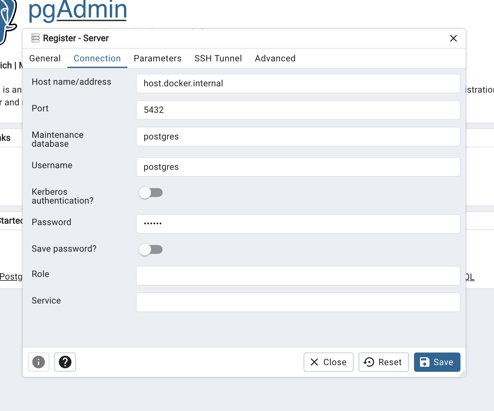

Before installing Song, ensure that the following tools and services are installed and properly configured. While you can choose any platform, we recommend Linux for optimal performance and compatibility.

1. **Docker**

    - For ease of use, we recommend using <a href="https://www.docker.com/products/docker-desktop/" target="_blank" rel="noopener noreferrer">Docker Desktop</a>
    - If you prefer using the command line, you can install the <a href="https://docs.docker.com/engine/install/" target="_blank" rel="noopener noreferrer">Docker Engine here</a>

2. **PostgreSQL**

    - We store all [Song related metadata](/documentation/ego/technical) within PostgreSQL databases
    - Instructions for <a href="https://www.postgresql.org/download/" target="_blank" rel="noopener noreferrer">downloading and installing PostgreSQL can be found here</a>
    - We also provide a docker quickstart for database setup below. This does not require PostgreSQL installation


<Note title="Setting up the Companion File transfer Service">Song interacts with a required companion application, Score, which manages file transfers and object storage. Please note that although both services are needed, there is no necessary order of installation required.</Note>

# PostgreSQL Quickstart

We will be using docker to set up our PostgreSQL database for Ego.

1. **Pull and Run PostgreSQL** 

Use the following command to pull and run the PostgreSQL docker container:

```bash
docker run --name postgresSong -e POSTGRES_PASSWORD=abc123 -e POSTGRES_DB=songDb -p 5432:5432 -d postgres                                       
```

This command spins up a PostgreSQL container named `postgresSong` with the default username `postgres`, password of `abc123` and creates a database within it called `songDb`. 

2. **Pull and Run PgAdmin4 (optional)** 

PgAdmin4 is an open-source, web-based tool that provides a convenient and user-friendly interface for managing PostgreSQL databases. Use the following command to pull and run the PgAdmin4 docker container:

```bash
docker run --name my-pgadmin -p 82:80 -e 'PGADMIN_DEFAULT_EMAIL=email@domain.com' -e 'PGADMIN_DEFAULT_PASSWORD=abc123' -d dpage/pgadmin4
```

This command spins up a PgAdmin4 container accessible from `http://localhost:82/`. Once deployed you will need to login using the credentials specified within the docker run command. In our example above this is `email@domain.com` with the password `abc123`.

3. **Connect your database to PgAdmin4 (optional)**  

Select **Add New Server** name your server and then **select the connection tab** and input the following:



These values may be different depending on the values you provided during step 1

| Field | Value |
|---|---|
| Host name/address: | `host.docker.internal` |
| Port: | `5432` |
| Username: | `postgres` |
| Password: | `abc123` |

4. **Click Save** 

From the left-hand server drop-down, you can now view the connected database(s)
